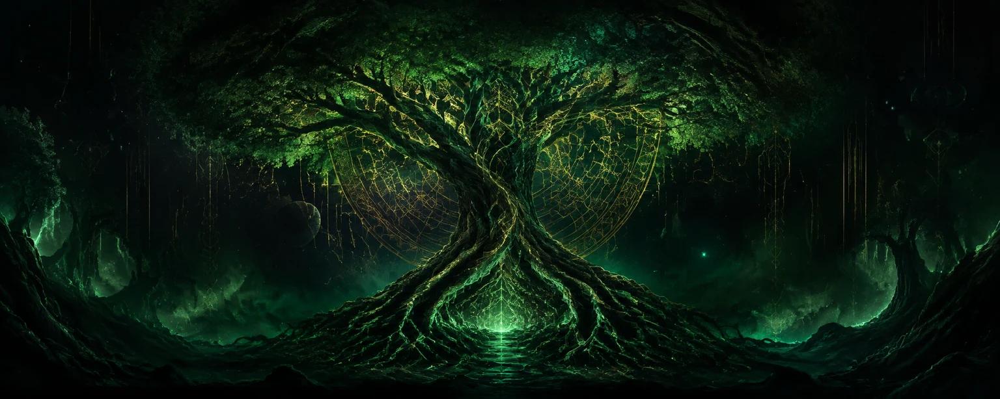

  

# Mxgics

Building useful tools, game-data dashboards, and clean web experiences. 🎮 🌿

## Current quests

- Crafting a fast, accessible portfolio with an evidence-first release process.
- Turning Clash of Clans data into clear, reliable progression insights.
- Building a Windows dashboard that makes software inventory and updates easier to understand.

## Loadout

**Core:** `TypeScript` · `Angular` · `Astro` · `C#` · `.NET` · `Blazor Hybrid` · `WPF`

**Data & delivery:** `PostgreSQL` · `SQLite` · `Docker` · `GitHub Actions`

**Cloud:** `AWS` · `Azure`

## How I build

I care about accessible interfaces, reproducible verification, resilient failure handling, and documentation that stays aligned with the software.

> Quietly building. Carefully testing. Always learning.

